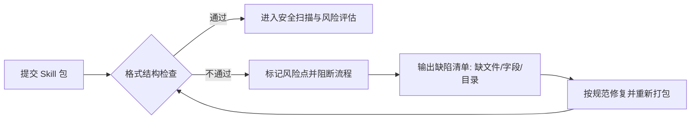

# 问题发现后的风险点示意与处置说明

本文用于解释当扫描器发现问题后，如何快速判断风险、确定处置优先级，并形成统一闭环。

## 一、风险分级思路（先定优先级）

- **严重**：存在 Critical 命中，或可形成直接攻击链，必须立即阻断上线。
- **高**：触发不通过门禁（如 High 数量/评分阈值），上线前必须修复并复检。
- **中**：未触发门禁，但存在明显风险暴露，需要在迭代窗口完成整改。
- **低**：存在轻微风险信号，纳入常规治理。
- **无风险**：未发现风险信号。

> 补充规则：前置 Skill 包格式结构检查不通过时，结论为“不通过”，等级直接标记为“高”，评分为 0（该分值不代表可放行）。

建议门禁策略（可按业务调优）：

- `fail_on_critical=true` 且 `Critical > 0` 时直接 `FAIL`
- `High >= high_count_threshold` 时 `FAIL`
- `score >= score_threshold` 时 `FAIL`

## 二、风险点示意（按检测类型）

| 检测类型 | 常见风险点示意 | 主要影响 | 推荐处置 |
| --- | --- | --- | --- |
| Prompt 注入与越权 | 忽略系统指令、角色劫持、诱导工具越权 | 安全策略失效、执行越权动作 | 阻断高危指令，增加策略校验与人工审批 |
| 混淆与执行链路 | 解码后执行、输入直达 `exec/eval/subprocess` | 远程代码执行、主机被控 | 禁止动态执行链，替换为白名单解析 |
| 敏感信息外传 | 读取凭据后网络发送 | Token/密钥泄露、数据合规风险 | 断开外联、轮换密钥、加审计 |
| 供应链脚本攻击 | `preinstall/postinstall` 远程下载执行 | 构建阶段被植入后门 | 禁止远程执行脚本，锁定依赖并校验来源 |
| SAST 危险调用 | `eval/exec/os.system/pickle.load` 等 | 命令注入、反序列化利用 | 改为安全 API，增加输入校验 |
| 配置与权限风险 | `DEBUG=true`、`CORS=*`、`verify=false` | 暴露调试信息、中间人风险 | 配置基线强制校验，CI 阶段阻断 |
| 恶意特征与可疑行为 | 下载执行、编码执行、异常长 Base64 | 恶意载荷落地、隐蔽执行 | 隔离样本、行为复核、增强规则 |
| 依赖与供应链 | 漏洞依赖、未锁版本、来源不可信 | 已知漏洞被利用 | 升级依赖、锁版本、启用 SBOM/漏洞扫描 |
| Skill 包格式结构检查失败（前置校验） | 缺少必需文件、目录层级错误、清单字段缺失/非法、版本命名不规范 | 扫描规则无法正确加载、风险检测漏检、错误包被误放行 | 将结构校验设为强制门禁；失败即阻断后续扫描与发布；按模板修复后重新提交 |

### 2.1 前置 Skill 包结构校验失败示意

> 建议：将“前置 Skill 包格式结构检查”作为第一道硬门禁；未通过时不允许进入后续检测链路，避免“未检即放行”。

## 三、处置流程（建议标准化）

1. **判定影响面**：确认命中规则、文件、路径、证据链（`chain_evidence`）。
2. **执行阻断**：触发门禁条件时立即阻断发布，禁止带病上线。
3. **修复与验证**：开发修复后，执行回归测试与全量扫描复检。
4. **审计留痕**：记录问题、责任人、处置时间、复检结果。
5. **规则回灌**：将真实样本沉淀到测试用例，防止同类回归。

## 四、落地建议（短期可执行）

- 将“关联攻击链”与“敏感外传”设为优先阻断项。
- 在 CI 固化阈值策略，避免人工判断不一致。
- 每次规则升级必须通过“命中/不命中/边界/绕过”四类测试。
- 为例外放行设置有效期和审批人，避免长期豁免。
